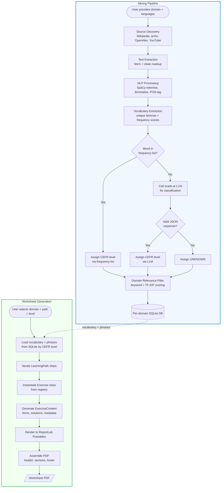

# langwich

**Automated language learning worksheet generator for e-paper devices and print.**

langwich generates professional PDF worksheets for language learning. It uses a domain-specific vocabulary database, configurable learning paths, and a mining pipeline that builds vocabulary from open-access scientific and educational sources.

---

## Features

- **Domain-specific vocabulary**: Separate SQLite databases per domain+language combo (railway operations, medicine, space exploration, etc.)
- **Open-access mining**: Pulls vocabulary from Wikipedia, arXiv, OpenAlex, YouTube transcripts, and more
- **CEFR classification**: Rule-based level tagging (A1–C2) with LLM fallback via scads.ai
- **Configurable learning paths**: Define exercise sequences — Vocabulary Focus, Reading First, Balanced, Production, Multimedia
- **9 exercise types**: Vocab matching, fill-in-the-blanks, synonyms, translation, reading comprehension, creative writing, text summary, YouTube tasks, drawing tasks
- **Cupertino-style PDFs**: Clean, modern design optimised for e-paper legibility and print

---

## Architecture

### Class Diagram


### Process Diagram



---

## Tech Stack

| Component | Technology |
|-----------|------------|
| Language | Python 3.11+ |
| Database | SQLite via SQLAlchemy 2.0 |
| NLP | SpaCy 3.7 |
| PDF Rendering | ReportLab 4.1 |
| LLM Fallback | scads.ai (OpenAI-compatible API) |
| HTTP Client | httpx |
| Configuration | Pydantic Settings |
| YouTube | youtube-transcript-api |
| Parsing | BeautifulSoup4, lxml, feedparser |

---

## Setup

### Prerequisites

- Python 3.11 or later
- A SpaCy language model (downloaded automatically on first run)
- (Optional) A scads.ai API key for LLM-based CEFR classification fallback

### Installation

```bash
# Clone the repository
git clone https://github.com/your-org/langwich.git
cd langwich

# Create a virtual environment
python -m venv .venv
source .venv/bin/activate  # Windows: .venv\Scripts\activate

# Install dependencies
pip install -e .

# Or install from requirements.txt
pip install -r requirements.txt

# Download SpaCy model
python -m spacy download en_core_web_sm

# Copy and configure environment variables
cp .env.example .env
# Edit .env with your scads.ai API key
```

---

## Usage

### 1. Mine vocabulary for a domain

```python
import asyncio
from langwich.db.manager import DomainDatabase
from langwich.mining.pipeline import MiningPipeline
from langwich.mining.sources import WikipediaSource, ArxivSource

# Create a domain database
db = DomainDatabase(domain="railway-operations", source_lang="en", target_lang="de")
db.initialize()

# Set up sources and run the mining pipeline
sources = [WikipediaSource(), ArxivSource()]
pipeline = MiningPipeline(db=db, sources=sources)
result = asyncio.run(pipeline.run())

print(f"Mined {result.terms_added} terms and {result.phrases_added} phrases")
```

### 2. Generate a worksheet

```python
from langwich.db.manager import DomainDatabase
from langwich.db.models import CEFRLevel
from langwich.generator import WorksheetGenerator
from langwich.paths.defaults import BUILTIN_PATHS

# Open an existing domain database
db = DomainDatabase(domain="railway-operations", source_lang="en", target_lang="de")
db.initialize()

# Generate a worksheet
generator = WorksheetGenerator(
    db=db,
    path=BUILTIN_PATHS["balanced"],
    level=CEFRLevel.B1,
)
pdf_path = generator.generate()
print(f"Worksheet saved to: {pdf_path}")
```

### 3. CLI usage

```bash
# Generate a worksheet from the command line
langwich --domain railway-operations --source-lang en --target-lang de --level B1 --path balanced
```

### 4. Custom learning path

```python
from langwich.paths.template import LearningPath, PathStep, ExerciseType

custom_path = LearningPath(
    name="My Custom Path",
    description="Vocab + Reading + Writing",
    steps=[
        PathStep(ExerciseType.VOCAB_MATCHING, "Key Terms", required=True),
        PathStep(ExerciseType.READING_COMPREHENSION, "Read & Understand"),
        PathStep(ExerciseType.CREATIVE_WRITING, "Express Yourself",
                 config={"num_vocab_to_use": 8, "line_count": 12}),
    ],
)
```

---

## Project Structure

```
langwich/
├── README.md
├── pyproject.toml
├── requirements.txt
├── .env.example
├── docs/
│   ├── architecture.md
│   ├── class_diagram.mermaid
│   └── process_diagram.mermaid
├── src/
│   └── langwich/
│       ├── __init__.py
│       ├── config.py
│       ├── generator.py
│       ├── db/
│       │   ├── models.py          # SQLAlchemy ORM models
│       │   └── manager.py         # Per-domain DB manager
│       ├── mining/
│       │   ├── pipeline.py        # 7-stage mining orchestrator
│       │   ├── domain_tagger.py
│       │   ├── sources/
│       │   │   ├── base.py        # Abstract Source class
│       │   │   ├── wikipedia.py
│       │   │   ├── arxiv.py
│       │   │   ├── openalex.py
│       │   │   └── youtube.py
│       │   └── nlp/
│       │       ├── tokenizer.py
│       │       ├── phrase_extractor.py
│       │       └── cefr_classifier.py
│       ├── paths/
│       │   ├── template.py        # LearningPath, PathStep
│       │   └── defaults.py        # 5 built-in path templates
│       ├── exercises/
│       │   ├── base.py            # Abstract Exercise class
│       │   ├── vocab_matching.py
│       │   ├── fill_blanks.py
│       │   ├── synonyms.py
│       │   ├── translation.py
│       │   ├── reading.py
│       │   ├── creative_writing.py
│       │   ├── text_summary.py
│       │   ├── youtube_task.py
│       │   └── drawing_task.py
│       └── rendering/
│           ├── pdf_renderer.py    # Cupertino-style PDF engine
│           ├── styles.py          # Typography + colours
│           └── components.py      # Reusable PDF components
├── scripts/
│   └── render_diagrams.py
└── tests/
    └── __init__.py
```

---

## License

MIT
