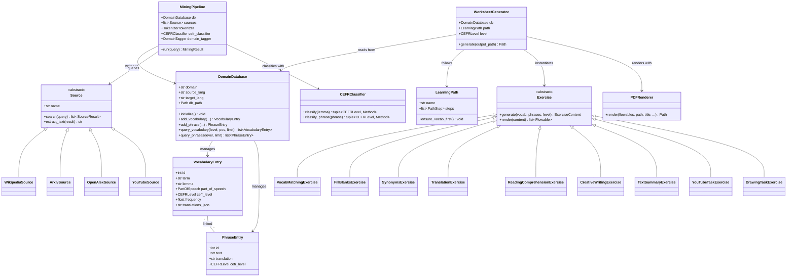

# langwich

**Automated language learning worksheet generator for e-paper devices and print.**

langwich generates professional PDF worksheets for language learning. It supports domain-specific vocabulary, configurable learning paths, and 9 different exercise types — all rendered in a clean Cupertino-style design optimised for e-paper and print.

---

## Quick Start

```bash
pip install -e .
```

That's it. The core needs only Python 3.11+ and four packages: reportlab, sqlalchemy, pydantic, pydantic-settings. No SpaCy, no API keys, no `.env` file.

### Using with Claude Code (recommended)

Run the `/langwich` slash command. Claude walks you through picking your languages, topics, and level, then generates the vocabulary and worksheets for you automatically. Nothing else to install.

### Using from the command line

Provide vocabulary as a JSON file and generate a worksheet:

```bash
langwich --from-json vocab.json --level B1 --path balanced
```

The JSON format is simple — see [JSON Format](#json-format) below.

---

## Two Modes

### 1. LLM Mode (default) — zero extra dependencies

The AI assistant generates vocabulary, translations, CEFR levels, and example phrases directly, writes them as JSON, and feeds them to `langwich --from-json`. This is the fastest path from zero to worksheet.

### 2. Mining Mode (optional) — automated corpus extraction

Uses SpaCy + web sources (Wikipedia, arXiv, OpenAlex, YouTube) to mine domain-specific vocabulary automatically.

```bash
# Install mining extras
pip install -e ".[mining]"
python -m spacy download en_core_web_sm

# Mine and generate
langwich --domain railway-operations --source-lang en --target-lang de --level B1 --path balanced
```

---

## Features

- **Domain-specific vocabulary**: Separate SQLite databases per domain+language combo
- **9 exercise types**: Vocab matching, fill-in-the-blanks, synonyms, translation, reading comprehension, creative writing, text summary, YouTube tasks, drawing tasks
- **5 learning paths**: Vocabulary Focus, Reading First, Balanced, Production, Multimedia
- **CEFR levels**: A1 through C2, with level-appropriate content selection
- **Cupertino-style PDFs**: Clean Helvetica typography, high contrast, e-paper optimised
- **Optional mining pipeline**: SpaCy NLP + open-access sources for automated vocabulary extraction

---

## JSON Format

The `--from-json` input uses this structure:

```json
{
  "domain": "railway-operations",
  "source_lang": "en",
  "target_lang": "de",
  "vocabulary": [
    {
      "term": "platform",
      "lemma": "platform",
      "pos": "NOUN",
      "cefr": "A2",
      "translations": ["Bahnsteig", "Gleis"],
      "frequency": 0.85
    }
  ],
  "phrases": [
    {
      "text": "The train departs from platform 3.",
      "translation": "Der Zug faehrt von Gleis 3 ab.",
      "cefr": "A2"
    }
  ]
}
```

Fields: `term` (required), `lemma` (defaults to lowercase term), `pos` (NOUN/VERB/ADJ/ADV/OTHER), `cefr` (A1-C2), `translations` (list of strings), `frequency` (0.0-1.0).

---

## Architecture

### Class Diagram



### Process Diagram


---

## Tech Stack

| Component | Package | Required |
|-----------|---------|----------|
| PDF Rendering | ReportLab 4.1 | Core |
| Database | SQLAlchemy 2.0 (SQLite) | Core |
| Configuration | Pydantic Settings | Core |
| NLP | SpaCy 3.7 | Mining extra |
| LLM Fallback | scads.ai (OpenAI-compatible) | Mining extra |
| HTTP Client | httpx | Mining extra |
| YouTube | youtube-transcript-api | Mining extra |
| Parsing | BeautifulSoup4, lxml, feedparser | Mining extra |

---

## Configuration

Copy `.env.example` to `.env` if you need to change defaults. For the core LLM mode, no configuration is required.

---

## Project Structure

```
langwich/
├── README.md
├── pyproject.toml
├── requirements.txt              # Core deps only
├── .env.example
├── docs/
│   ├── architecture.md
│   ├── class_diagram.mermaid
│   └── process_diagram.mermaid
├── src/
│   └── langwich/
│       ├── __init__.py
│       ├── config.py
│       ├── generator.py          # CLI entry point + WorksheetGenerator
│       ├── import_data.py        # JSON vocabulary import (LLM mode)
│       ├── db/
│       │   ├── models.py         # SQLAlchemy ORM models
│       │   └── manager.py        # Per-domain DB manager
│       ├── mining/               # Optional — pip install langwich[mining]
│       │   ├── pipeline.py
│       │   ├── domain_tagger.py
│       │   ├── sources/
│       │   │   ├── base.py
│       │   │   ├── wikipedia.py
│       │   │   ├── arxiv.py
│       │   │   ├── openalex.py
│       │   │   └── youtube.py
│       │   └── nlp/
│       │       ├── tokenizer.py
│       │       ├── phrase_extractor.py
│       │       └── cefr_classifier.py
│       ├── paths/
│       │   ├── template.py       # LearningPath, PathStep
│       │   └── defaults.py       # 5 built-in path templates
│       ├── exercises/
│       │   ├── base.py           # Abstract Exercise class
│       │   ├── vocab_matching.py
│       │   ├── fill_blanks.py
│       │   ├── synonyms.py
│       │   ├── translation.py
│       │   ├── reading.py
│       │   ├── creative_writing.py
│       │   ├── text_summary.py
│       │   ├── youtube_task.py
│       │   └── drawing_task.py
│       └── rendering/
│           ├── pdf_renderer.py   # Cupertino-style PDF engine
│           ├── styles.py         # Typography + colours
│           └── components.py     # Reusable PDF components
├── scripts/
│   └── render_diagrams.py
└── tests/
    └── __init__.py
```

---

## License

MIT
