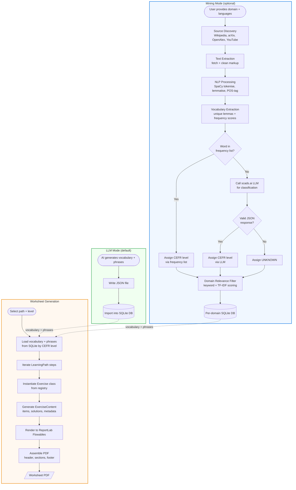

# langwich

**Automated language learning worksheet generator for e-paper devices and print.**

langwich generates professional PDF worksheets for language learning. It supports domain-specific vocabulary, configurable learning paths, and 35 different exercise types — all rendered in a clean Cupertino-style design optimised for e-paper and print.

---

## Quick Start

```bash
pip install -e .
```

That's it. The core needs only Python 3.11+ and four packages: reportlab, sqlalchemy, pydantic, pydantic-settings. No SpaCy, no API keys, no `.env` file.

### Using with Claude Code (recommended)

Run the `/langwich` slash command. Claude walks you through picking your languages, topics, and level, then generates the vocabulary and worksheets for you automatically. Nothing else to install.

### Using from the command line

Provide vocabulary as a JSON file and generate a worksheet:

```bash
langwich --from-json vocab.json --level B1 --path balanced

# Vocabulary at the start instead of the end
langwich --from-json vocab.json --level B1 --vocab-position start

# Skip the AI upload recommendation
langwich --from-json vocab.json --level B1 --no-ai-recommendation
```

The JSON format is simple — see [JSON Format](#json-format) below.

---

## Two Modes

### 1. LLM Mode (default) — zero extra dependencies

The AI assistant generates vocabulary, translations, CEFR levels, and example phrases directly, writes them as JSON, and feeds them to `langwich --from-json`. This is the fastest path from zero to worksheet.

### 2. Mining Mode (optional) — automated corpus extraction

Uses SpaCy + web sources (Wikipedia, arXiv, OpenAlex, YouTube) to mine domain-specific vocabulary automatically.

```bash
# Install mining extras
pip install -e ".[mining]"
python -m spacy download en_core_web_sm

# Mine and generate
langwich --domain railway-operations --source-lang en --target-lang de --level B1 --path balanced
```

---

## Features

- **Domain-specific vocabulary**: Separate SQLite databases per domain+language combo
- **35 exercise types** across 9 categories (see below)
- **5+ learning paths**: Vocabulary Focus, Reading First, Balanced, Production, Multimedia, and more
- **CEFR levels**: A1 through C2, with level-appropriate content selection
- **Cupertino-style PDFs**: Clean Helvetica typography, high contrast, e-paper optimised
- **Vocabulary reference at the end**: Word list placed after exercises with a recommendation to use the words and grammar rules (position configurable via `--vocab-position`)
- **AI feedback recommendation**: Every worksheet ends with a tip to upload completed work to an AI assistant for instant correction
- **Optional mining pipeline**: SpaCy NLP + open-access sources for automated vocabulary extraction

---

## Exercise Types (35)

### Core Vocabulary & Grammar
| Type | Size | CEFR | Description |
|------|------|------|-------------|
| `vocab_matching` | Half | A1+ | Match terms to translations |
| `fill_blanks` | Half | A1+ | Complete sentences with missing words from word bank |
| `synonyms` | Half | A1+ | Write synonyms and antonyms for terms |
| `opposites` | Half | A1+ | Write antonyms / match opposites |
| `translation` | Half | A1+ | Translate sentences between languages |
| `word_stems` | Half | A2+ | Conjugation and declination tables |

### Reading & Text Analysis
| Type | Size | CEFR | Description |
|------|------|------|-------------|
| `reading_comprehension` | Double | A2+ | Read a passage, answer comprehension questions |
| `text_summary` | Full | A2+ | Summarise a passage in 2–3 sentences |
| `word_marking` | Half | A2+ | Mark specific word categories (attributive, localization, temporal, modal) in a text |
| `cloze_text` | Full | B1+ | Classic cloze test — every nth word removed |

### Text Production (Genres)
| Type | Size | CEFR | Description |
|------|------|------|-------------|
| `creative_writing` | Full | A2+ | Open-ended writing prompts using target vocabulary |
| `poetry_writing` | Full | A2+ | Write a poem (acrostic, haiku, limerick, free verse) |
| `news_headline` | Full | A2+ | Write newspaper headlines and lead paragraphs (or academic abstracts) |
| `press_release` | Full | B1+ | Write a press release with structured template |
| `job_application` | Full | B1+ | Write a formal cover letter responding to a job ad |
| `blog_post` | Full | A2+ | Write an informal blog post with personal opinion |
| `movie_review` | Full | A2+ | Write a review (movie, book, restaurant, product) with rating |
| `text_transformation` | Full | B1+ | Rewrite a text changing register, tense, person, or voice |

### Conversation & Dialogue
| Type | Size | CEFR | Description |
|------|------|------|-------------|
| `conversation` | Full | A1+ | Complete or write a dialogue (gap-fill, free, or role-play modes) |

### Puzzles & Games
| Type | Size | CEFR | Description |
|------|------|------|-------------|
| `word_search` | Half | A1+ | Find vocabulary words hidden in a letter grid |
| `crossword` | Full | A1+ | Crossword puzzle — clues are translations or definitions |
| `odd_one_out` | Half | A1+ | Identify which word doesn't belong in a group |
| `sentence_reorder` | Half | A1+ | Arrange scrambled words into correct sentence order |

### Numbers, Time & Calculation
| Type | Size | CEFR | Description |
|------|------|------|-------------|
| `time_and_date` | Half | A1+ | Tell time, read schedules, write dates |
| `number_tasks` | Half | A1+ | Telephone numbers, years, prices, technology specs |
| `calculation` | Half | A1+ | Math word problems in the target language |
| `statistics` | Full | B1+ | Read charts, calculate percentages, interpret data |

### Real-World Texts
| Type | Size | CEFR | Description |
|------|------|------|-------------|
| `recipe` | Full | A2+ | Read, write, or reorder recipe steps |
| `walkthrough` | Full | A2+ | Write step-by-step instructions / how-to guide |

### Listening & Media
| Type | Size | CEFR | Description |
|------|------|------|-------------|
| `youtube_task` | Full | A2+ | Video comprehension with URL/QR code and questions |
| `listening_steps` | Full | A2+ | Segmented YouTube listening with timestamps and step-by-step questions |

### Visual & Preparation
| Type | Size | CEFR | Description |
|------|------|------|-------------|
| `drawing_task` | Half | A1+ | Visual sketch or diagram in response to a prompt |
| `dictation_prep` | Half | A1+ | Practice writing words before a dictation |
| `error_correction` | Half | A2+ | Find and correct deliberate mistakes in sentences |

---

## JSON Format

The `--from-json` input uses this structure:

```json
{
  "domain": "railway-operations",
  "source_lang": "en",
  "target_lang": "de",
  "vocabulary": [
    {
      "term": "platform",
      "lemma": "platform",
      "pos": "NOUN",
      "cefr": "A2",
      "translations": ["Bahnsteig", "Gleis"],
      "frequency": 0.85
    }
  ],
  "phrases": [
    {
      "text": "The train departs from platform 3.",
      "translation": "Der Zug faehrt von Gleis 3 ab.",
      "cefr": "A2"
    }
  ]
}
```

Fields: `term` (required), `lemma` (defaults to lowercase term), `pos` (NOUN/VERB/ADJ/ADV/OTHER), `cefr` (A1-C2), `translations` (list of strings), `frequency` (0.0-1.0).

---

## Architecture

### Class Diagram

```mermaid
classDiagram
    direction TB

    class DomainDatabase {
        +str domain
        +str source_lang
        +str target_lang
        +Path db_path
        +initialize() void
        +add_vocabulary(...) VocabularyEntry
        +add_phrase(...) PhraseEntry
        +query_vocabulary(level, pos, limit) list~VocabularyEntry~
        +query_phrases(level, limit) list~PhraseEntry~
    }

    class VocabularyEntry {
        +int id
        +str term
        +str lemma
        +PartOfSpeech part_of_speech
        +CEFRLevel cefr_level
        +float frequency
        +str translations_json
    }

    class PhraseEntry {
        +int id
        +str text
        +str translation
        +CEFRLevel cefr_level
    }

    class MiningPipeline {
        +DomainDatabase db
        +list~Source~ sources
        +Tokenizer tokenizer
        +CEFRClassifier cefr_classifier
        +DomainTagger domain_tagger
        +run(query) MiningResult
    }

    class Source {
        <<abstract>>
        +str name
        +search(query) list~SourceResult~
        +extract_text(result) str
    }

    class WikipediaSource
    class ArxivSource
    class OpenAlexSource
    class YouTubeSource

    class CEFRClassifier {
        +classify(lemma) tuple~CEFRLevel, Method~
        +classify_phrase(phrase) tuple~CEFRLevel, Method~
    }

    class LearningPath {
        +str name
        +list~PathStep~ steps
        +ensure_vocab_first() void
    }

    class Exercise {
        <<abstract>>
        +generate(vocab, phrases, level) ExerciseContent
        +render(content) list~Flowable~
    }

    class VocabMatchingExercise
    class FillBlanksExercise
    class SynonymsExercise
    class TranslationExercise
    class ReadingComprehensionExercise
    class CreativeWritingExercise
    class TextSummaryExercise
    class YouTubeTaskExercise
    class DrawingTaskExercise
    class PoetryWritingExercise
    class NewsHeadlineExercise
    class PressReleaseExercise
    class JobApplicationExercise
    class BlogPostExercise
    class MovieReviewExercise
    class ConversationExercise
    class WordSearchExercise
    class CrosswordExercise
    class WordStemsExercise
    class OppositesExercise
    class TimeAndDateExercise
    class NumberTasksExercise
    class CalculationExercise
    class StatisticsExercise
    class WordMarkingExercise
    class RecipeExercise
    class WalkthroughExercise
    class ListeningStepsExercise
    class ErrorCorrectionExercise
    class SentenceReorderExercise
    class OddOneOutExercise
    class ClozeTextExercise
    class DictationPrepExercise
    class TextTransformationExercise

    class WorksheetGenerator {
        +DomainDatabase db
        +LearningPath path
        +CEFRLevel level
        +generate(output_path) Path
    }

    class PDFRenderer {
        +render(flowables, path, title, ...) Path
    }

    Source <|-- WikipediaSource
    Source <|-- ArxivSource
    Source <|-- OpenAlexSource
    Source <|-- YouTubeSource

    Exercise <|-- VocabMatchingExercise
    Exercise <|-- FillBlanksExercise
    Exercise <|-- SynonymsExercise
    Exercise <|-- TranslationExercise
    Exercise <|-- ReadingComprehensionExercise
    Exercise <|-- CreativeWritingExercise
    Exercise <|-- TextSummaryExercise
    Exercise <|-- YouTubeTaskExercise
    Exercise <|-- DrawingTaskExercise
    Exercise <|-- PoetryWritingExercise
    Exercise <|-- NewsHeadlineExercise
    Exercise <|-- PressReleaseExercise
    Exercise <|-- JobApplicationExercise
    Exercise <|-- BlogPostExercise
    Exercise <|-- MovieReviewExercise
    Exercise <|-- ConversationExercise
    Exercise <|-- WordSearchExercise
    Exercise <|-- CrosswordExercise
    Exercise <|-- WordStemsExercise
    Exercise <|-- OppositesExercise
    Exercise <|-- TimeAndDateExercise
    Exercise <|-- NumberTasksExercise
    Exercise <|-- CalculationExercise
    Exercise <|-- StatisticsExercise
    Exercise <|-- WordMarkingExercise
    Exercise <|-- RecipeExercise
    Exercise <|-- WalkthroughExercise
    Exercise <|-- ListeningStepsExercise
    Exercise <|-- ErrorCorrectionExercise
    Exercise <|-- SentenceReorderExercise
    Exercise <|-- OddOneOutExercise
    Exercise <|-- ClozeTextExercise
    Exercise <|-- DictationPrepExercise
    Exercise <|-- TextTransformationExercise

    MiningPipeline --> DomainDatabase : writes to
    MiningPipeline --> Source : queries
    MiningPipeline --> CEFRClassifier : classifies with
    WorksheetGenerator --> DomainDatabase : reads from
    WorksheetGenerator --> LearningPath : follows
    WorksheetGenerator --> Exercise : instantiates
    WorksheetGenerator --> PDFRenderer : renders with
    DomainDatabase --> VocabularyEntry : manages
    DomainDatabase --> PhraseEntry : manages
    VocabularyEntry "*" -- "*" PhraseEntry : linked
```



### Process Diagram



---

## Tech Stack

| Component | Package | Required |
|-----------|---------|----------|
| PDF Rendering | ReportLab 4.1 | Core |
| Database | SQLAlchemy 2.0 (SQLite) | Core |
| Configuration | Pydantic Settings | Core |
| NLP | SpaCy 3.7 | Mining extra |
| LLM Fallback | scads.ai (OpenAI-compatible) | Mining extra |
| HTTP Client | httpx | Mining extra |
| YouTube | youtube-transcript-api | Mining extra |
| Parsing | BeautifulSoup4, lxml, feedparser | Mining extra |

---

## Configuration

Copy `.env.example` to `.env` if you need to change defaults. For the core LLM mode, no configuration is required.

---

## Project Structure

```
langwich/
├── README.md
├── pyproject.toml
├── requirements.txt              # Core deps only
├── .env.example
├── docs/
│   ├── architecture.md
│   ├── class_diagram.mermaid
│   └── process_diagram.mermaid
├── src/
│   └── langwich/
│       ├── __init__.py
│       ├── config.py
│       ├── generator.py          # CLI entry point + WorksheetGenerator
│       ├── import_data.py        # JSON vocabulary import (LLM mode)
│       ├── db/
│       │   ├── models.py         # SQLAlchemy ORM models
│       │   └── manager.py        # Per-domain DB manager
│       ├── mining/               # Optional — pip install langwich[mining]
│       │   ├── pipeline.py
│       │   ├── domain_tagger.py
│       │   ├── sources/
│       │   │   ├── base.py
│       │   │   ├── wikipedia.py
│       │   │   ├── arxiv.py
│       │   │   ├── openalex.py
│       │   │   └── youtube.py
│       │   └── nlp/
│       │       ├── tokenizer.py
│       │       ├── phrase_extractor.py
│       │       └── cefr_classifier.py
│       ├── paths/
│       │   ├── template.py       # LearningPath, PathStep
│       │   └── defaults.py       # 5 built-in path templates
│       ├── exercises/
│       │   ├── base.py           # Abstract Exercise class
│       │   ├── vocab_matching.py
│       │   ├── fill_blanks.py
│       │   ├── synonyms.py
│       │   ├── translation.py
│       │   ├── reading.py
│       │   ├── creative_writing.py
│       │   ├── text_summary.py
│       │   ├── youtube_task.py
│       │   └── drawing_task.py
│       └── rendering/
│           ├── pdf_renderer.py   # Cupertino-style PDF engine
│           ├── styles.py         # Typography + colours
│           └── components.py     # Reusable PDF components
├── scripts/
│   └── render_diagrams.py
└── tests/
    └── __init__.py
```

---

## License

MIT
