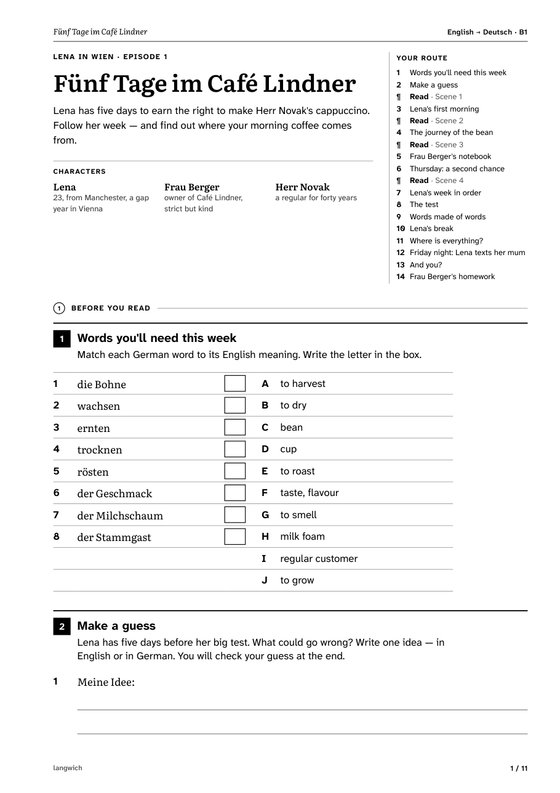
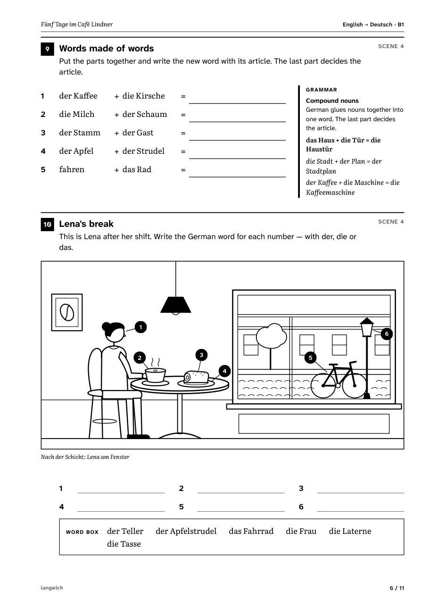
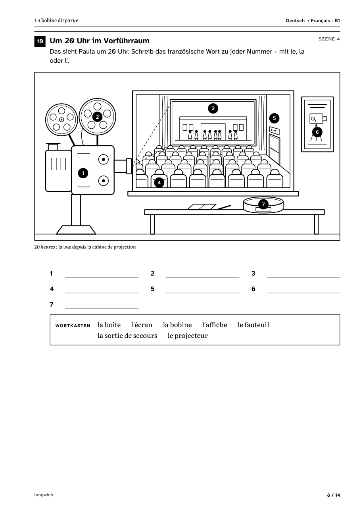
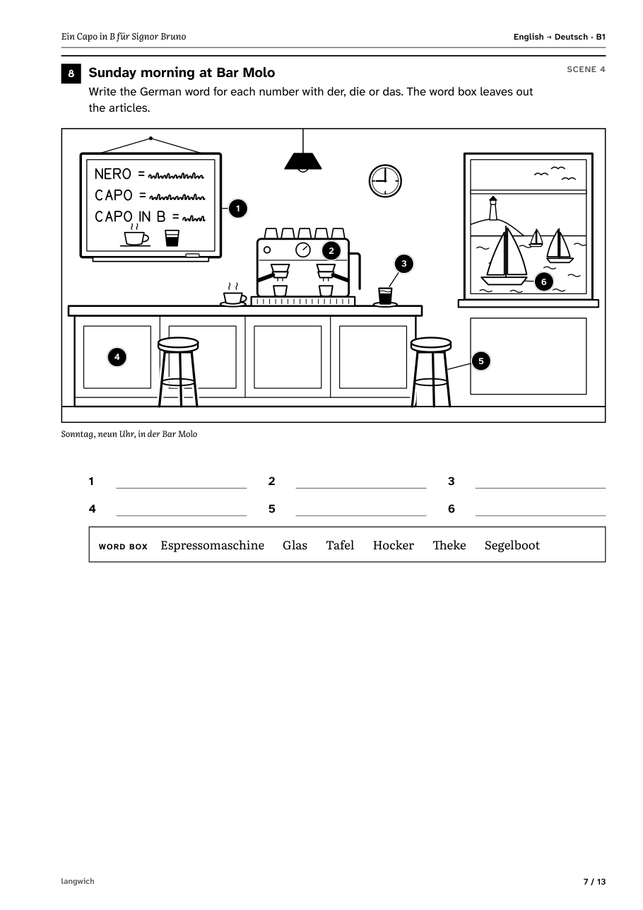

# langwich

**Story worksheets for language learners — written by any AI, typeset for paper and e-paper.**

<p align="center">
  
  
</p>

langwich turns a short story into a worksheet you work through with a pen. An AI model of your
choice — Claude, ChatGPT, Gemini, or one running on your own computer — writes a story in the
language you are learning, told in scenes, with true facts woven in, plus every task that leads
you through it and all the answers. langwich checks what the model wrote, puts the tasks in
lesson order (before you read → scene by scene → your turn → take it further) and typesets a
calm, black-and-white PDF for an e-paper tablet or a printer. Then the screen goes off.

**Website:** [joernmht.github.io/langwich](https://joernmht.github.io/langwich/) — why paper, and
how to use langwich with whichever AI you have.

**Contents:**
[Quick start](#quick-start) ·
[Make your own worksheet](#make-your-own-worksheet) ·
[How a worksheet is built](#how-a-worksheet-is-built) ·
[The JSON contract](#the-json-contract-langwich3) ·
[Rendering](#rendering) ·
[Profile](#profile) ·
[CLI reference](#cli-reference) ·
[Project structure](#project-structure) ·
[Development](#development) ·
[AI disclaimer](#ai-disclaimer)

---

## Quick start

You need Python 3.11 or newer. langwich installs into a virtual environment (`.venv`), which
keeps it apart from your system's Python — recent Ubuntu, Debian and Homebrew refuse a bare
`pip install` outside one:

```bash
git clone https://github.com/joernmht/langwich.git
cd langwich
python3 -m venv .venv
. .venv/bin/activate        # Windows: .venv\Scripts\activate
pip install -e .
langwich render examples/lena_01_en_de.json
```

This writes `data/lena_01_en_de.pdf`, and next to it the `.html` file it was made from. In a new
terminal, activate the environment again (`. .venv/bin/activate`) or call `.venv/bin/langwich`
directly. For a `langwich` command that works everywhere without activating anything, install it
with `pipx install -e .` or `uv tool install -e .` instead.

Worksheets that come with the repository include:

| File | Story | Languages | Level |
|---|---|---|---|
| [`examples/lena_01_en_de.json`](examples/lena_01_en_de.json) | *Fünf Tage im Café Lindner* — Lena, on a gap year in Vienna, has five days to earn the right to make Herr Novak's Melange, the café's strictest regular. Episode 1 of the series *Lena in Wien*. | English → German | B1 |
| [`examples/lena_02_en_de.json`](examples/lena_02_en_de.json) | *Ein Capo in B für Signor Bruno* — episode 2: Lena runs her injured uncle's espresso bar in Trieste and has to learn how the city orders its coffee. | English → German | B1 |
| [`examples/festival_lyon_de_fr.json`](examples/festival_lyon_de_fr.json) | *La bobine disparue* — a mystery at the Festival Lumière in Lyon: a film reel vanishes two hours before a sold-out screening. Episode 1 of the series *Paula à Lyon*. | German → French | B1 |
| [`examples/mercado_valencia_en_es.json`](examples/mercado_valencia_en_es.json) | *La lista de la abuela Pepa* — Emily shops for her host grandmother's Sunday paella at Valencia's Mercado Central. A one-off story. | English → Spanish | A2 |
| [`examples/evora_street_en_pt.json`](examples/evora_street_en_pt.json) | *A mesma rua* — Hannah has one afternoon in Évora to find the street in her grandmother's fifty-year-old photo. Built from a real open-licence photo with `langwich prompt --image` (photo: Ken & Nyetta, CC BY 2.0). | English → Portuguese | A2 |

Every file in [`examples/`](examples/) validates without a single warning; the PDFs are in
[`docs/examples/`](docs/examples/).

### PDFs need Pango

langwich makes PDFs with [WeasyPrint](https://weasyprint.org), which needs the Pango text
library (and HarfBuzz's font subsetter) from your operating system:

| System | Install |
|---|---|
| Debian, Ubuntu | `sudo apt install libpango-1.0-0 libpangoft2-1.0-0 libharfbuzz-subset0` |
| macOS (Homebrew) | `brew install pango` — if WeasyPrint still cannot find it, `export DYLD_FALLBACK_LIBRARY_PATH=/opt/homebrew/lib` |
| Windows | follow [WeasyPrint's installation guide](https://doc.courtbouillon.org/weasyprint/stable/first_steps.html) |

Without Pango, `langwich render` still writes the HTML file and tells you so: open it in a
browser and print it to PDF. The other commands (`prompt`, `validate`, `schema`, `kinds`) do not
need Pango at all.

**Offline by design.** langwich calls no AI service and stores no key. The renderer fetches
nothing: WeasyPrint may load only `data:` URIs and the bundled fonts, and SVG line art is
cleaned of scripts, `<foreignObject>` and links to outside files before it is embedded. The only
thing langwich ever loads from outside the JSON is the picture a worksheet names in
`picture.image` — a local file, or a URL it downloads when you render.

---

## Make your own worksheet

Three steps, whichever AI you use:

```bash
# 1. Say what you want; langwich prints a complete brief for the AI
langwich prompt --source en --target de --level B1 --topic "sourdough bread" -o prompt.txt

# 2. Give prompt.txt to an AI and save its answer as data/sourdough_bread_en_de.json

# 3. Check the file, then typeset it
langwich validate data/sourdough_bread_en_de.json
langwich render data/sourdough_bread_en_de.json
```

**The brief** is a self-contained Markdown prompt of about 350 lines: story craft, a level table,
which language goes where, the lesson arc, rules for good task items, a field reference, a short
example that validates, and a checklist. The AI needs nothing else — no access to this repository,
no plug-in. Without `-o` the brief goes to standard output. At the end, `langwich prompt` suggests
where to save the answer, following the naming convention: `data/<topic>_<source>_<target>.json`,
episodes of a series `data/<series>_<nn>_<source>_<target>.json`.

**The topic is yours.** `--topic` can be anything: "tides", "the Vienna Philharmonic", "how a
bicycle gear works". Leave it out and the AI chooses. `--frame` picks the kind of story
(`episode`, `reportage`, `case_study`, `diary`, `letters`, `mystery`, `dialogue`, `other`),
`--scenes N` its length (2–7 scenes; the level sets a default), and `--notes "…"` passes on
anything else ("make it funny", "use the subjunctive", "set it in Graz"). `--device epaper`,
`print` or `color` says where the sheet will be used (`color` also allows colour in pictures).

**Checking.** `langwich validate` reports errors (they block rendering) and warnings (worth
fixing), each with a location in the file and a sentence on how to fix it:

```text
data/sourdough_bread_en_de.json: 2 errors, 2 warnings

Errors (must be fixed before rendering):
  /tasks/3/scene  [unknown-scene]
      there is no scene with id 's5'. Use one of the ids in story.scenes: 's1', 's2', 's3', 's4'.
  /vocabulary/target/10  [target-not-in-items]
      'der Sauerteig' is listed in vocabulary.target but not in vocabulary.items. Add an item with exactly this term (with translation and pos), or remove the word from vocabulary.target.

Warnings (worth fixing; rendering still works):
  /vocabulary/target/10  [target-not-in-story]
      the target word 'der Sauerteig' does not occur in any scene text. Work it into the story (an inflected form is fine), or remove it from vocabulary.target.
  /vocabulary/target/10  [target-underused]
      the target word 'der Sauerteig' is practised in 0 tasks; use every target word in at least two tasks (e.g. a match pair and a cloze gap or writing must_use), or remove it from vocabulary.target.
```

**The repair loop.** `langwich validate FILE --prompt` turns every problem, plus the JSON itself,
into a repair prompt. Give it to the same AI, save the corrected answer over the file, and
validate again until it prints `OK: no problems found.`

```bash
langwich validate data/sourdough_bread_en_de.json --prompt > repair.txt
```

Some problems are not the AI's to fix, and the repair prompt leaves them out: a picture file that
is missing (`image-not-found`) or cannot be read (`image-unreadable`). `--prompt` prints those for
you on standard error instead. They are errors when the picture has numbered labels or a label
or picture task needs it, otherwise warnings. When nothing but such problems is left, `--prompt`
prints no prompt at all and exits with status 1. And when the "JSON" is only the brief's
`NO PICTURE ATTACHED` reply (`no-picture-attached`), there is nothing to repair: the AI never saw
the photo, so `--prompt` says so and exits with status 1 — attach the picture and ask again.

### With Claude Code

Open this repository in [Claude Code](https://claude.com/claude-code) and run `/langwich`,
optionally followed by a topic, a photo path or "next episode". Claude asks for your languages
and level once (and remembers them in the [profile](#profile)), offers a few story ideas built on
your interests, runs `langwich prompt`, writes the JSON into `data/`, validates and repairs it,
reviews language and facts, renders the PDF and checks that the picture labels sit on the right
objects. Files are named `data/<slug>_<source>_<target>.json`, episodes of a series
`data/lena_01_en_de.json`, `data/lena_02_en_de.json` and so on.

### With a chat AI (ChatGPT, Gemini, Claude.ai …)

1. `langwich prompt … -o prompt.txt`
2. Paste the contents of `prompt.txt` into a new chat, or attach the file.
3. Copy the reply — one JSON object — into a file such as `data/tides_en_de.json`. A chatty
   reply is fine too: if the object sits in a Markdown code fence or between lines of prose,
   langwich reads just the object and warns (`wrapped-json`). Known slips are read leniently and
   warned about as well (`normalized`): a kind written `multiple-choice`, `mcq`,
   `fill_in_the_blanks`, `true_or_false`, `matching`, `ordering`, `short_answer`, `essay` or
   `drawing`, facts written as plain strings, a lower-case level such as `b1`. Nothing else is
   guessed — a missing comma, for instance, is an error that says where to look.
4. `langwich validate data/tides_en_de.json`. If there are problems, paste the output of
   `langwich validate data/tides_en_de.json --prompt` into the same chat and save the new reply
   over the file.
5. `langwich render data/tides_en_de.json`

Larger models write better stories and make fewer mistakes, but any model that follows long
instructions can do it; `langwich validate` catches the structural slips.

### With a local model (Ollama, LM Studio, llama.cpp)

langwich calls no API and stores no key, so it works completely offline with a model on your own
computer.

```bash
langwich prompt --target es --level A2 --topic "a night market" --compact -o prompt.txt
```

- **`--compact`** prints a brief half as long, with 3 scenes and the same contract — made for
  small models (7–14B parameters). Larger local models can take the full brief.
- **Context window:** the compact brief is about 3,500 tokens and a finished worksheet another
  6,000–12,000, so give the model at least 16k tokens of context — 32k for the repair loop, which
  sends the whole JSON back. Ollama's default is far smaller, and a worksheet cut off in the
  middle is not valid JSON. Make a copy of the model with a 32k context once, and use that:

  ```bash
  printf 'FROM gemma3:12b\nPARAMETER num_ctx 32768\n' > Modelfile
  ollama create gemma3-32k -f Modelfile
  ollama run gemma3-32k --format json < prompt.txt > data/night_market_en_es.json
  ```

  (Or start the server with `OLLAMA_CONTEXT_LENGTH=32768 ollama serve`, or set the context length
  in the Ollama app.) In LM Studio, set the context length when you load the model.
- Paste the brief into the model's chat, save the JSON it answers with, and run
  `langwich validate`. Small models make more mistakes; the repair loop
  (`langwich validate FILE --prompt`) usually fixes them in a round or two.

### Starting from a photo

A photo — your own, or an open-licence image — can be the starting point:

```bash
langwich prompt --image photos/market.jpg --topic "a market in Valencia" -o prompt.txt
```

- **The AI must see the photo.** Attach it to the chat together with the brief; use a model that
  accepts images (ChatGPT, Gemini and Claude do; locally a vision model such as Gemma 3 or
  Qwen2.5-VL). If the model cannot see a picture, the brief tells it to answer
  `NO PICTURE ATTACHED` instead of inventing one.
- The story is built around the photo: one scene describes exactly what it shows, and 4–8
  numbered labels sit on visible objects for a label task ("name what you see"). `--topic` is
  optional; without it the topic comes from the picture.
- **The photo is copied into `data/pictures/`.** `langwich prompt --image` copies a local photo
  to `data/pictures/<name>.<ext>` (a plain ASCII file name) and tells the AI to write exactly
  `"pictures/<name>.<ext>"` as `picture.image`. Save the JSON in `data/` — relative paths are
  resolved against the JSON file's folder — and the worksheet renders wherever the folder goes.
  `--data-dir DIR` copies to `DIR/pictures/` instead, for JSON you keep in `DIR`.
- **Formats:** JPEG, PNG, WebP and GIF are copied as they are; any other format Pillow can read
  is converted to JPEG. iPhone HEIC photos need `pip install pillow-heif` (or
  `pip install -e ".[heic]"`) — or export the photo as JPEG first. langwich says so when it
  cannot read a file.
- **A URL** is kept as it is: the brief names it, and langwich downloads it when you render.
- **Missing pictures** are reported by `langwich validate` (`image-not-found`,
  `image-unreadable`): as errors when the picture carries numbered labels or a label or picture
  task needs it, otherwise as warnings. These are for you to fix, not the AI; the repair prompt
  leaves them out.
- The AI estimates the label positions. Look at the picture page after rendering; if a number sits
  beside its object, adjust `x`/`y` in the JSON and render again.
- **Example:** [`examples/evora_street_en_pt.json`](examples/evora_street_en_pt.json) was made
  this way from a CC BY photo of a street in Évora ([`examples/pictures/evora-street.jpg`](examples/pictures/evora-street.jpg));
  its `picture.credit` carries the attribution the licence requires.
- Photos are printed in high-contrast greyscale; `langwich render … --allow-color` keeps colour.

### Continuing a series

Worksheets can be episodes of one story with the same characters. Start a series with
`--frame episode` — the brief then asks for a `series` block with a teaser for the next episode.
A series in any other frame takes `--series` (`--frame mystery --series`, like *La bobine
disparue*); `--no-series` makes an `episode`-style story a one-off (like *La lista de la abuela
Pepa*). Continue a series with `--continue`:

```bash
langwich prompt --continue examples/lena_02_en_de.json -o prompt.txt
```

The brief for the next episode carries the cast (same ids and names), the story so far, the last
scene in full, the teaser to pick up, the words to recycle and the new episode number. Languages,
level and frame come from the previous file. Save the answer next to the previous episode with
the number counted up — `lena_02_en_de.json` → `lena_03_en_de.json`. From episode 2 on, the sheet
opens with a "Previously" recap, and `langwich validate` warns when a review word is not used.
`--continue` also works on a one-off worksheet: the new story becomes its episode 2.

### From your own text

Build a worksheet on a text you choose — a newspaper article, a page from a textbook, your own
notes:

```bash
langwich prompt --from-text article.txt --level B1 -o prompt.txt
```

The AI keeps the text's facts and turns them into a story with tasks. `--from-text -` reads the
text from standard input.

### Upgrading langwich 2 files

langwich 2 files (a flat `content` text with `vocabulary`, `grammar` and `picture_scene`) no longer
render; `langwich render` explains why. Turn one into a brief that rewrites it as a langwich/3
story, keeping its facts and vocabulary:

```bash
langwich prompt --from-json tests/fixtures/legacy_v2_coffee.json -o prompt.txt
```

Languages and level are taken from the old file.

---

## How a worksheet is built

**The AI writes, langwich arranges.** Every word the learner reads — story, facts, vocabulary,
grammar notes, task items and answers — comes from the JSON. Python never invents content: it
validates, orders, lays out and renders. There is no heuristic fallback that cuts sentences out
of a text.

### The lesson arc

Each task has a `stage`, and most have a `scene`. langwich places them along a fixed arc, whatever
their order in the JSON:

1. **Before you read** — `warm_up` tasks: pre-teach the key words, make a prediction.
2. **Scene by scene** — the scene text, with glosses for unknown words in the side column and
   "Did you know?" fact boxes, then the tasks anchored to that scene, in the order `gist` →
   `detail` → `picture` → `form` → `practice`. Picture tasks come right after comprehension,
   because they are about the scene just read; form and practice items move the story on. A
   task follows the last scene it names; a task without a scene follows the last scene.
3. **Your turn** — `production` tasks: write about the story or yourself.
4. **Take it further** — `epilogue` tasks, such as a search in the target language.

Then come the teaser for the next episode (in a series), the word list, any grammar not shown
beside a task, the solutions and the scene translations. A grammar box appears beside the task
that practises it.

### The 13 task kinds

| Kind | The learner … | Key fields |
|---|---|---|
| `match` | matches left to right (letters in boxes) | `pairs[{left, right}]`, `extra[]` |
| `true_false` | ticks true or false and corrects the false ones | `items[{statement, answer, correction}]` |
| `multiple_choice` | ticks one option | `items[{question, options[], answer}]` |
| `order_events` | numbers events in story order | `events[]` (in the correct order; langwich shuffles) |
| `questions` | answers in writing | `items[{question, answer, lines}]` |
| `cloze` | fills gaps | `text` or `items[]` with gap markup, `hint`, `distractors[]` |
| `transform` | rewrites sentences | `items[{prompt, cue, answer}]` |
| `word_building` | combines parts into a word | `items[{parts[], answer}]` |
| `label` | names the numbered objects in a scene picture | `scene`, `bank` (the box shows the terms without articles) |
| `writing` | writes a text | `prompt`, `starter`, `must_use[]`, `min_words`, `max_words`, `lines`, `model_answer` |
| `dialogue` | fills or writes dialogue lines | `lines[{speaker, text \| cue, answer}]`, `bank`, `distractors[]` |
| `media_search` | searches online in the target language (no links — searching is the task) | `media`, `queries[]`, `questions[]` |
| `draw` | draws and labels | `prompt`, `labels[]` |

Every task also has `id`, `kind`, `stage` and optionally `scene` (one id or a list), `title`,
`instruction` and `grammar` (the id of a grammar point). `langwich kinds` prints this table and
the eight stages in lesson order: `warm_up`, `gist`, `detail`, `picture`, `form`, `practice`,
`production`, `epilogue`.

**Word boxes.** A cloze with `"hint": "word_bank"` and a dialogue with `"bank": true` print a box
with the gap answers plus the `distractors` — wrong but plausible words, so the last gap is not
solved by elimination. A label task's box (`"bank": true`) shows the terms *without* their
articles (`Tasse`, not `die Tasse`); the answer key keeps the full term. So an instruction such as
"Name the objects — with der, die or das" asks for something the box does not give away.

---

## The JSON contract (`langwich/3`)

The contract is defined once, as pydantic models in
[`src/langwich/model.py`](src/langwich/model.py). `langwich schema` prints it as JSON Schema (a
copy lives in [`src/langwich/schema/langwich-3.json`](src/langwich/schema/langwich-3.json), and
the website publishes it at its `$id`,
[joernmht.github.io/langwich/schema/langwich-3.json](https://joernmht.github.io/langwich/schema/langwich-3.json)),
and the brief from `langwich prompt` explains it to the AI. Unknown fields are errors — a
worksheet cannot carry a `$schema` key either. To have an editor check worksheets as you type,
map the files to the schema in the editor's settings instead — in VS Code, in the repository's
`.vscode/settings.json`:

```jsonc
"json.schemas": [
  {"fileMatch": ["data/*.json", "examples/*.json"], "url": "./src/langwich/schema/langwich-3.json"}
]
```

| Field | Required | Language | What it holds |
|---|---|---|---|
| `schema` | yes | — | always `"langwich/3"` |
| `title` | yes | target | the worksheet's title |
| `standfirst` | | source | one or two lines under the title: the stakes, what you will find out |
| `source_lang`, `target_lang` | yes | — | the learner's language and the one being learned (`en`, `de`, `pt-BR` …) |
| `cefr_level` | yes | — | `A1` … `C2` |
| `topic` | yes | source | what the story and its facts are about |
| `frame` | | — | `episode`, `reportage`, `case_study`, `diary`, `letters`, `mystery`, `dialogue`, `other` |
| `series` | | mixed | `id`, `title`, `episode`, `previously`, `next` (teaser), `review` (words to recycle) |
| `story` | yes | mixed | `logline`, `setting`, `characters[{id, name, role}]`, `scenes[]` |
| `story.scenes[]` | yes | target | `id`, `heading`, `beat`, `text` (blank lines split paragraphs), `translation` (source), `picture` |
| `facts[]` | | target | true, checkable facts shown as "Did you know?" boxes: `scene`, `title`, `text`, `source` |
| `vocabulary` | yes | mixed | `target[]` (the key words the tasks practise) and `items[{term, translation, pos, plural, forms, note, scene}]` |
| `grammar[]` | | mixed | `id`, `name`, `explanation`, `rule`, `table{head, rows}`, `examples[]`, `scene` |
| `tasks[]` | yes | mixed | titles and instructions in the source language, items in the target language |
| `ui` | | source | page labels for learner languages langwich has no built-in strings for |

This is the smallest file langwich accepts. `langwich validate` will say, rightly, that it is far
too thin to be a good lesson — no facts, one scene, no comprehension or writing task:

```json
{
  "schema": "langwich/3",
  "title": "Das Brot von Frau Roth",
  "source_lang": "en",
  "target_lang": "de",
  "cefr_level": "A2",
  "topic": "bread",
  "story": {
    "logline": "Tom wants to bake his first loaf before his neighbour's birthday.",
    "characters": [{"id": "tom", "name": "Tom", "role": "34, a nurse in Leipzig"}],
    "scenes": [
      {
        "id": "s1",
        "heading": "Samstag, sieben Uhr",
        "beat": "setup",
        "text": "Tom steht in der Küche. Der Teig ist kalt und klein.",
        "translation": "Tom is standing in the kitchen. The dough is cold and small."
      }
    ]
  },
  "vocabulary": {
    "target": ["der Teig"],
    "items": [{"term": "der Teig", "translation": "dough", "pos": "noun", "plural": "die Teige"}]
  },
  "tasks": [
    {
      "id": "t1",
      "kind": "cloze",
      "stage": "practice",
      "scene": "s1",
      "title": "Sunday: a second try",
      "instruction": "Fill the gap.",
      "hint": "none",
      "items": ["Am Sonntag ist der {{Teig}} warm und groß."]
    }
  ]
}
```

For complete worksheets, read the files in [`examples/`](examples/); for every field and its
limits, run `langwich schema`.

### Gap markup

Gaps in `cloze` texts and `dialogue` lines are written in double braces:

| Markup | Meaning |
|---|---|
| `{{geröstet}}` | the answer |
| `{{schwarz\|ohne Milch}}` | an answer and an accepted alternative |
| `{{geröstet::rösten}}` | an answer and a hint printed in brackets (a base form or a translation) |

The first answer goes into the answer key and the word box. `hint` sets what the learner gets:
`word_bank` (the default; add wrong words in `distractors`), `first_letter`, `base_form`,
`translation` or `none`. With `base_form` and `translation`, every gap needs a `::hint`. Gap
markup belongs in tasks only, never in the story.

```jsonc
{
  "id": "t4", "kind": "cloze", "stage": "form", "scene": "s2", "grammar": "g1",
  "title": "Jan's rules for the mudflats",
  "instruction": "Complete the rules with the right form of the verb in brackets.",
  "hint": "base_form",
  "items": [
    "Im Watt {{müsst::müssen}} ihr immer bei der Gruppe bleiben.",
    "Ihr {{dürft::dürfen}} die Seehunde nicht stören."
  ]
}
```

### Pictures

A scene can have a `picture` — usually the scene with the richest setting. It takes one of:

- **`image`** — a local path (relative paths are resolved against the JSON file's folder; by
  convention `"pictures/<file>"`, the folder `langwich prompt --image` copies to), an
  `http(s)` URL or a `data:` URI: the photo the story was built from, or an open-licence image
  from [Wikimedia Commons](https://commons.wikimedia.org) or [Openverse](https://openverse.org).
  Put the attribution the licence requires in `credit`.
- **`svg`** — simple black line art the AI draws itself: a complete `<svg>…</svg>` element,
  stroke-only, no text, no colour, like the drawings in [`examples/pictures/`](examples/pictures/).
  Scripts, `<foreignObject>` and links to outside files are removed before it is embedded.
- **neither** — then a `label` task turns into "draw and label", and `langwich render` prints the
  picture's `prompt` so you can generate or find an image later: save it in `data/pictures/` and
  set `picture.image` to `"pictures/<file>"`.

`labels` puts numbered markers on the picture: `n` is the number, `term` the target-language
answer, and `x`/`y` the position as fractions of the picture's width and height, from `0, 0`
(top left) to `1, 1` (bottom right). If the image already shows the numbers, set
`"numbers_in_image": true`. `caption` is printed under the picture; `prompt` — a description for
an illustrator or an image generator — is **never printed** on the sheet.

```jsonc
"picture": {
  "svg": "<svg xmlns='http://www.w3.org/2000/svg' viewBox='0 0 200 100' fill='none' stroke='#000'>…</svg>",
  "caption": "Angekommen auf Neuwerk",
  "prompt": "Black-and-white line drawing: a lighthouse on a low island, a seal on a sandbank.",
  "labels": [
    {"n": 1, "term": "der Seehund", "x": 0.25, "y": 0.77},
    {"n": 2, "term": "der Leuchtturm", "x": 0.785, "y": 0.34}
  ]
}
```

Raster images are converted to high-contrast greyscale unless you render with `--allow-color`;
SVG is embedded as drawn, minus anything unsafe. An image that cannot be read never crashes the
renderer: the picture is left out with a warning (and `langwich validate` reports it first).

<p align="center">
  
  
</p>

---

## Rendering

```bash
langwich render examples/lena_01_en_de.json --page epaper --solutions separate
langwich render examples/festival_lyon_de_fr.json --one-task-per-page -o worksheets/
langwich render examples/mercado_valencia_en_es.json -o market.html
```

- **Page size:** A4 (the default) or `--page epaper`, a 157.8 × 210.4 mm page with a single
  column, for e-paper tablets. The profile's `device` can make e-paper the default.
- **Flow:** tasks follow one another and are kept in one piece wherever they fit on a page;
  `--one-task-per-page` starts each task on a fresh page, with room for notes.
- **Solutions:** at the end (`--solutions append`, the default), as a separate
  `<name>-solutions.pdf` (`--solutions separate`), or not at all (`--solutions none`). The scene
  translations are printed with the solutions unless you pass `--no-translations`.
- **Output:** `data/<json name>.pdf` plus the `.html` beside it. `-o` takes a file name, a folder
  (ending in `/`), or a `.html` name, which writes the HTML only (as does `--html-only`).
- **Deterministic:** the same JSON always gives the same sheet, and the task page and the answer
  key share every shuffle. `--seed N` shuffles differently — say, a second version for a class.
- **Warnings:** anything rendering had to leave out or change — a picture that could not be
  used, say — is printed as a warning *before* the `Rendered '…'` line.
- **Strict:** `--strict` refuses to render while `langwich validate` reports warnings, and exits
  with status 1 when rendering itself produced warnings (the files are still written) — useful
  in scripts that must not ship an incomplete sheet.
- **Offline:** rendering fetches nothing but a `picture.image` URL the JSON names; see
  [Offline by design](#pdfs-need-pango).

The design is monochrome and made for e-paper first: two bundled open-licence typefaces
(**Literata** for the target language, **Atkinson Hyperlegible Next** for instructions), solid
writing lines 9 mm apart, blanks sized to the longest answer, a running header with the title and
the language pair. Page labels ("Before you read", "Solutions" …) are in the learner's language:
built in for English, German, French, Spanish, Italian and Portuguese. For any other learner
language, the brief asks the AI to add the translated labels as `ui`.

---

## Profile

`.langwich/profile.json` remembers your defaults, so you are not asked for your languages and
level every time:

```json
{
  "source_lang": "en",
  "target_lang": "de",
  "level": "B1",
  "color": false,
  "device": "epaper"
}
```

- `langwich prompt … --save-profile` stores the languages, level, colour choice and `--device` in
  `./.langwich/profile.json` — never the frame, which is a choice per story. The `/langwich`
  command writes the file too.
- langwich looks for the file in the current folder and its parents, up to the project root.
- Explicit flags win over the previous episode (`--continue`), which wins over a langwich 2 file
  (`--from-json`), which wins over the profile. Without any of them: English → German, B1.
- `device` sets the default page size for `langwich render`: e-paper names (`epaper`,
  `remarkable`, `kindle`, `kobo`, `boox`, `supernote`, `pocketbook`, `tolino`) mean e-paper,
  `a4` or `print` mean A4. `langwich prompt --device epaper|print|color` sets it for the brief
  and, with `--save-profile`, for later; `color` also allows colour in pictures.
- `color: true` allows colour in pictures (in the brief and when rendering).
- A `frame` you add by hand is used for every brief, and `langwich prompt` notes where it came
  from — `"frame": "episode"` makes each worksheet the start of a series.
- Other keys are kept untouched (the `/langwich` command stores your `interests` there).

---

## CLI reference

`langwich COMMAND …` or `python -m langwich COMMAND …`. `langwich --version` prints the version;
`langwich COMMAND --help` lists the options below.

### `langwich prompt` — a brief for any AI

| Option | Meaning |
|---|---|
| `--source LANG` | your language (default: profile, else `en`) |
| `--target LANG` | the language you learn (default: profile, else `de`) |
| `--level CEFR` | `A1` … `C2` (default: profile, else `B1`) |
| `--topic TOPIC` | what the story and its facts are about (default: the AI chooses) |
| `--frame FRAME` | `episode`, `reportage`, `case_study`, `diary`, `letters`, `mystery`, `dialogue`, `other` |
| `--scenes N` | number of scenes, 2–7 (default: set by the level) |
| `--image PATH_OR_URL` | build the story around this picture (attach it to your AI); a local file is copied to `data/pictures/` (converted to JPEG unless it is JPEG, PNG, WebP or GIF) and the brief names it `pictures/<file>`; a URL is used as it is |
| `--data-dir DIR` | the folder the worksheet JSON goes into (default: `data`); `--image` copies into its `pictures/` folder |
| `--from-text FILE` | build the worksheet on this text (`-` reads standard input) |
| `--from-json LEGACY_FILE` | upgrade a langwich 2 file |
| `--continue PREV_JSON` | write the next episode after this worksheet |
| `--color`, `--no-color` | allow colour in pictures (default: profile, else no) |
| `--device {epaper,print,color}` | where the sheet is used (default: profile); `epaper` makes `render` default to `--page epaper`, `color` implies `--color` |
| `--series`, `--no-series` | `--series`: episode 1 of a series, in any frame; `--no-series`: a one-off even with `--frame episode` (default: a series only with `--frame episode`) |
| `--compact` | a shorter brief for small local models |
| `--notes TEXT` | extra wishes for the AI |
| `-o FILE`, `--output FILE` | write the brief to FILE instead of standard output |
| `--save-profile` | remember languages, level, colour and device in `.langwich/profile.json` (never the frame) |

### `langwich validate FILE` — check a worksheet

| Option | Meaning |
|---|---|
| `--prompt` | print a repair prompt for the AI that wrote the file; problems only you can fix (a missing or unreadable picture file) go to standard error instead |
| `--json` | print the report as JSON (`ok`, `error_count`, `warning_count`, `issues`) |
| `--strict` | exit with status 1 on warnings too |

Exit status 0 means the file can be rendered. With `--prompt`, the exit status is 1 whenever no
usable prompt could be printed: the file is the `NO PICTURE ATTACHED` reply, or only picture-file
problems are left.

### `langwich render FILE` — make the PDF

| Option | Meaning |
|---|---|
| `-o OUT`, `--output OUT` | output PDF (default: `data/<json name>.pdf`); a folder keeps the default name, a `.html` name writes HTML only |
| `--page {a4,epaper}` | page size (default: the profile's `device`, else A4) |
| `--one-task-per-page` | start every task on a new page |
| `--solutions {append,separate,none}` | solutions at the end (default), as `<name>-solutions.pdf`, or none |
| `--no-translations` | leave the scene translations out of the answer section |
| `--allow-color` | keep images in colour (default: high-contrast greyscale) |
| `--seed SEED` | seed for the shuffles (default: derived from the JSON) |
| `--html-only` | write the HTML only, no PDF |
| `--strict` | refuse to render when validation reports warnings; exit with status 1 when rendering produced warnings |

`render` validates first and stops on errors. Rendering warnings are printed before the
`Rendered '…'` line.

### `langwich schema` and `langwich kinds`

`langwich schema` prints the JSON Schema (`-o FILE` writes it to a file); `langwich kinds` lists
the task kinds and lesson stages.

### Old command lines

`langwich --from-json FILE` still works as a deprecated alias of `langwich render FILE` (with `-o`
and `--allow-color`); `--exercises`, `--image`, `--image-credit` and `--engine` are ignored with a
note. `langwich --list-exercises` shows `langwich kinds`.

---

## Project structure

```text
langwich/
├── src/langwich/
│   ├── model.py        the langwich/3 contract (pydantic): the single source of truth
│   ├── markup.py       {{gap}} markup
│   ├── validate.py     checks beyond the schema; issues with locations and fixes
│   ├── plan.py         the lesson arc, glosses, sidebars, seeded shuffles
│   ├── answers.py      the answer key, independent of the renderer
│   ├── images.py       load, convert and embed pictures
│   ├── locale.py       page labels in en, de, fr, es, it, pt
│   ├── prompt.py       authoring and repair prompts for any AI
│   ├── series.py       what the next episode builds on
│   ├── profile.py      .langwich/profile.json
│   ├── cli.py          render, validate, schema, prompt, kinds
│   ├── render/         HTML + print CSS, converted to PDF by WeasyPrint
│   │   ├── html.py     the worksheet along the lesson arc
│   │   ├── tasks.py    the 13 task kinds
│   │   ├── css.py      print CSS for A4 and e-paper
│   │   ├── metrics.py  text measurement with the bundled fonts
│   │   └── options.py  render options and results
│   ├── fonts/          Literata and Atkinson Hyperlegible Next (SIL Open Font License)
│   └── schema/         langwich-3.json, generated from model.py
├── examples/           example worksheets; pictures/ holds their pictures
├── data/               your worksheets, pictures/ and PDFs (created on first use; not in git)
├── tests/              pytest suite; tests/test_docs.py keeps this README honest
├── scripts/            export_schema.py, update_page_stats.py, build_showcase.py
├── docs/               the website (index.html), architecture.md, assets/, examples/ (PDFs)
├── .github/workflows/  ci.yml (lint, types, schema, tests), pages.yml (the website)
├── .claude/commands/langwich.md    the /langwich command for Claude Code
└── LICENSE             Apache-2.0
```

[`docs/architecture.md`](docs/architecture.md) explains the design: the modules and their
interfaces, how the planner places tasks, and every validation rule.

---

## Development

```bash
python3 -m venv .venv && . .venv/bin/activate
pip install -e ".[dev]"
pytest
ruff check src tests scripts
mypy
python scripts/export_schema.py --check
python3 scripts/update_page_stats.py --check
python3 scripts/build_showcase.py --check
```

- **Tests:** `pytest` runs the whole suite. Tests that make PDFs skip when WeasyPrint or PyMuPDF
  cannot be loaded; with `LANGWICH_REQUIRE_PDF=1` (as in CI) they fail instead.
  [`tests/test_docs.py`](tests/test_docs.py) checks the docs themselves: every `langwich …`
  command in a code block must parse, every flag must exist and every CLI option must appear in
  this README, every complete JSON worksheet must pass the contract (fence partial excerpts as
  `jsonc`), every example must validate cleanly, stage sequences must follow the lesson order,
  and this README must mention every task kind.
- **Lint and types:** ruff runs a pinned rule set (`[tool.ruff.lint]` in `pyproject.toml`), and
  the dev extra caps ruff and mypy, so a new release of either cannot fail CI on unchanged code.
- **Schema:** after changing `model.py`, run `python scripts/export_schema.py` to regenerate
  `src/langwich/schema/langwich-3.json`. CI runs `python scripts/export_schema.py --check`,
  which compares the parsed JSON, so a pydantic release that only formats numbers differently
  is a note, not a failure. The Pages
  workflow publishes the file at its `$id`.
- **Website numbers:** `python3 scripts/update_page_stats.py` writes the number of task kinds,
  stages, built-in languages and examples into `docs/index.html`. The Pages workflow runs it
  before each deploy.
- **Previews:** `python3 scripts/build_showcase.py` renders the examples into `docs/examples/`
  (PDFs) and `docs/assets/` (the PNG previews shown here and on the website). Run it after
  changing the renderer, the planner or an example, and commit both folders.
  `python3 scripts/build_showcase.py --check` writes nothing: it renders into a temporary
  folder and compares page count and page text with the committed PDFs.
- **Versions:** the version is `__version__` in `src/langwich/__init__.py`; `pyproject.toml`
  reads it from there.
- **CI:** [`.github/workflows/ci.yml`](.github/workflows/ci.yml) installs Pango and HarfBuzz and
  runs ruff, mypy, the schema check, pytest (with `LANGWICH_REQUIRE_PDF=1`) and the showcase
  check on Python 3.11, 3.12 and 3.13; a second job installs the oldest dependency versions
  `pyproject.toml` allows and runs the tests (except the page-break checks tuned to the newest
  WeasyPrint) and a render of every example; [`.github/workflows/pages.yml`](.github/workflows/pages.yml)
  publishes `docs/` and the JSON Schema to GitHub Pages.
- **Debugging:** when rendering fails with an unexpected error, `LANGWICH_DEBUG=1 langwich render FILE`
  shows the traceback.

---

## AI disclaimer

This repository was developed with substantial assistance from AI coding tools (primarily
Anthropic's Claude). Code, documentation and results have been reviewed by the author, who takes
full responsibility for the content.

langwich also asks an AI to write the worksheets themselves. Language models make mistakes — in
facts, in grammar, in answers. `langwich validate` catches structural problems, not false facts
or unidiomatic sentences, so read a worksheet before you hand it to someone else.

## License

Apache-2.0 — see [`LICENSE`](LICENSE) and [`NOTICE`](NOTICE). The bundled fonts, Literata and Atkinson Hyperlegible Next, are
licensed under the SIL Open Font License 1.1; their licence texts are in
[`src/langwich/fonts/`](src/langwich/fonts/).
